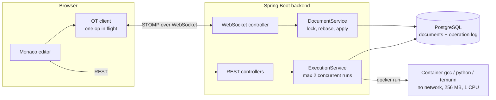

# CodeSync

[](https://github.com/aaditya8589/CodeSync/actions/workflows/ci.yml)

A real-time collaborative code editor: several people edit the same files at the same time, and anyone in the room can compile and run the code in a sandbox.

<!-- Demo: record a short GIF of two browser tabs typing at once and clicking Run Code, save it as docs/demo.gif, then replace this comment with  -->

## What works

- **Concurrent editing with Operational Transformation.** Two people typing in the same line converge to the same text; nobody's keystrokes are lost.
- **Live cursors and presence.** Everyone sees who is in the room and where each person's caret and selection are, with a coloured name label, kept exact while both sides type.
- **Version history.** Browse earlier versions of a file (edits grouped by pauses, with who made them), compare any version with the current file side by side, and restore it for everyone in the room.
- **Server-authoritative documents.** Every edit is validated, rebased and saved by the server; refreshing, joining late or restarting the server keeps the code.
- **Sandboxed execution of C++, Python and Java, with input.** Run compiles and runs the room's saved code in a throw-away Docker container with no network and hard limits, and reports judge-style results (compile error, runtime error, time limit, memory limit).
- **Files.** Anyone in the room can add files (`.cpp`, `.py`, `.java`, `.txt`, ...), which start with a template for their language and appear in everyone's file list immediately.
- **Rooms and access control.** JWT authentication, room membership checked on every REST call, WebSocket subscription and edit.

## Architecture



### Edit flow

1. The client turns each Monaco change into an operation such as `[4821, "x", 5203]` (keep 4821 characters, insert `x`, keep 5203) and sends it with the revision it was based on.
2. The server locks the document row (`SELECT ... FOR UPDATE`), loads the operations the client had not seen yet, and **transforms** the incoming operation past them.
3. It applies the result, saves the content and an operation-log entry in one transaction, and broadcasts the transformed operation.
4. The sender treats the broadcast as an acknowledgement; everyone else transforms it against their own unacknowledged edits and applies it without moving their cursor.

## Design decisions

| Decision | Why |
|---|---|
| **OT instead of a CRDT (e.g. Yjs)** | Run Code needs an authoritative plain-text copy on the server; the server already ordered edits with revisions; offline and peer-to-peer editing are not goals. |
| **One operation in flight per client** | Edits typed while waiting are composed into one buffered operation, so fast typing sends far fewer messages (about 14 messages for 80 keystrokes in testing). |
| **Run the saved copy, not code sent by the browser** | Everyone in the room runs exactly the same code, and nobody can run code they cannot see. |
| **Code and input passed to the container over stdin** | No host folders are mounted into the container, which keeps the sandbox small and avoids path problems. |
| **Deny-by-default WebSocket rules** | Only the exact room topic and the user's private error queue may be subscribed to, and clients may only send to `/app/...`. An attack script showed that wildcard subscriptions and direct broker sends were possible before this. |
| **Cursors as positions at a revision, transformed on arrival** | A cursor is only sent when the sender has no unacknowledged edits, so its offset means "this position in server revision R". The receiver moves it through the operations since R and its own unsent edits, so cursors stay exact under concurrent typing. |
| **Presence kept in memory, cursors never touch the database** | Presence only matters while a connection is open. The subscription check records which rooms a connection may use, so frequent cursor messages are checked against memory; the sender's name and tab ID come from the server, so nobody can move someone else's cursor. |
| **Snapshots plus the operation log for history** | The log stores how many characters an edit deleted, not which, so old versions cannot be rebuilt backwards from the current text. A full snapshot is saved at a file's first edit and every 100 revisions; any version is the nearest earlier snapshot plus at most 100 replayed operations. |
| **Restore is an ordinary edit** | Restoring computes one operation from the current text to the old text and applies it like typing, so every open editor receives it live, concurrent edits are transformed as usual, and a restore can itself be undone from the history. |
| **Synchronous execution with a 2-slot limit** | Simple and measurable; a queue with separate workers is the next step only if real load needs it. |

## Sandbox

Every run gets a fresh container:

```
docker run --rm -i --network none --memory 256m --memory-swap 256m --cpus 1 --pids-limit 64
  --read-only --tmpfs /tmp:rw,exec,size=64m --user 1000:1000 --cap-drop ALL
  --security-opt no-new-privileges <image for the language> ...
```

| Language | Image | Check before running | Time limit |
|---|---|---|---|
| C++ (`.cpp`, `.cc`) | `gcc:14` | `g++ -O2 -std=c++17` | 2 s |
| Python (`.py`) | `python:3.13-slim` | `python3 -m py_compile` (syntax errors are reported like compile errors) | 5 s |
| Java (`.java`) | `eclipse-temurin:21-jdk` | `javac`; the file is named after the program's `public class`, so `Solution` works as well as `Main` | 4 s |

The time limit applies to the program only; the whole run is limited to 20 seconds (after which the container is killed by name), and output to 64 KB per stream. A Java `OutOfMemoryError` or Python `MemoryError` counts as a memory limit. CI runs real attacks in every language on every push: infinite loop, memory bomb, fork bomb, network access, output flood and writing outside `/tmp`.

The class name taken from Java source goes into a shell command, so only a plain identifier is accepted; anything else falls back to `Main`.

## Testing

| Area | Tests |
|---|---|
| OT core (Java) | 29: hand-checked cases, 10,000 random convergence and compose cases, JSON round-trips, UTF-16 checks |
| OT core and client (TypeScript) | 40: the same algorithm, 500 simulated three-client sessions with delays and reordering, Monaco change conversion, and 300 sessions checking that every remote cursor lands on exactly the right character |
| Version history (Java) | 11: grouping edits into versions, and against the real database: every one of 250 revisions rebuilt exactly across snapshots, restore and undoing a restore, history that starts after older edits, invalid revisions, non-members |
| Presence (Java) | 15: the presence registry, and the controller rejecting cursors from connections that did not pass the room check |
| Code runner | 20 with a fake `docker` (every outcome including hung containers and Docker being down, each language's command and image), 3 for language detection, and 25 against real Docker in all three languages |
| Files | 4 for file names and templates, 6 against the real database (creation, case-insensitive duplicates, invalid names, the 20-file limit, non-members) |
| Integration scripts | `frontend/scripts/ot-server-check.mjs` (two clients against the running server) and `frontend/scripts/ws-security-check.mjs` (a non-member trying to read, inject, and join presence) |

The Java and TypeScript OT implementations were cross-checked to produce identical results on 5,000 random cases. Mutation tests confirmed the suites fail when key parts of the algorithm are broken.

## Run it locally

Requirements: Java 21+, Node 22+, PostgreSQL, Docker Desktop.

```powershell
# once: create the database and pull the compiler image
psql -U postgres -c "CREATE DATABASE codesync"
docker pull gcc:14
docker pull python:3.13-slim
docker pull eclipse-temurin:21-jdk

# backend (http://localhost:8080)
cd backend
$env:DB_PASSWORD = "<your postgres password>"
$env:JWT_SECRET = "<a random string of at least 32 characters>"
.\mvnw.cmd spring-boot:run

# frontend (http://localhost:5173)
cd frontend
npm install
npm run dev
```

Tests:

```powershell
cd backend;  .\mvnw.cmd test                      # needs PostgreSQL for the Spring context test
$env:CODESYNC_DOCKER_TESTS = "true"; .\mvnw.cmd test -Dtest=CodeRunnerDockerTest
cd frontend; npm test
```

### Configuration

All secrets and environment-specific values come from environment variables, so nothing secret is in the repository.

| Variable | Required | Default | Purpose |
|---|---|---|---|
| `DB_PASSWORD` | yes | | PostgreSQL password |
| `JWT_SECRET` | yes | | Key that signs login tokens, at least 32 characters. The backend refuses to start without it. |
| `DB_URL` | no | `jdbc:postgresql://localhost:5432/codesync` | Database location |
| `DB_USERNAME` | no | `postgres` | Database user |
| `CORS_ALLOWED_ORIGINS` | no | `http://localhost:5173` | Comma-separated frontend URLs allowed to call the API and open WebSockets |
| `JWT_EXPIRATION_MINUTES` | no | `60` | How long a login lasts |
| `CODESYNC_IMAGE_CPP`, `CODESYNC_IMAGE_PYTHON`, `CODESYNC_IMAGE_JAVA` | no | `gcc:14`, `python:3.13-slim`, `eclipse-temurin:21-jdk` | Image used to run each language |
| `SHOW_SQL` | no | `false` | Log every SQL query |
| `VITE_API_URL` (frontend, at build time) | no | `http://localhost:8080` | Backend URL; the WebSocket URL is derived from it |

Generate a secret in PowerShell with a cryptographic random generator:

```powershell
$bytes = New-Object byte[] 48
[System.Security.Cryptography.RandomNumberGenerator]::Create().GetBytes($bytes)
[Convert]::ToBase64String($bytes)
```

## Project structure

```
backend/src/main/java/com/codesync/backend
  ot/          TextOperation: apply, compose, transform, rebase, JSON
  service/     DocumentService (OT on the server), RoomService
  execution/   CodeRunner (Docker sandbox), ExecutionService
  config/      Security, WebSocket configuration and authorization
frontend/src
  ot/          textOperation, otClient state machine, Monaco adapter
  hooks/       useCodeSync (STOMP connection, resync)
  components/  CodeEditor (one Monaco model per file)
```

## Known limitations

- Undo also undoes other people's edits (collaborative undo is not implemented).
- Edits typed while disconnected are discarded on reconnect; the editor is read-only while disconnected.
- The operation log is never compacted.

## Roadmap

More languages, a problem set with test cases, deployment.
